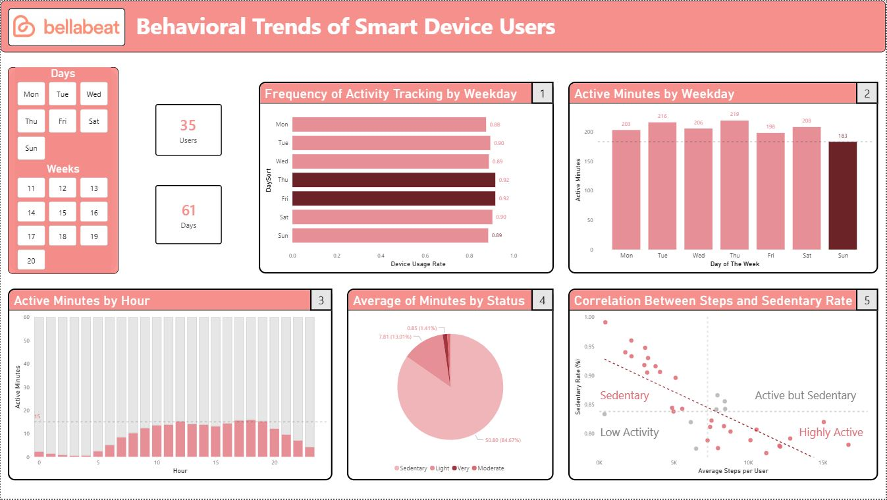

# Bellabeat Case Study: Behavioral Trends of Smart Device Users

## 📋 Background:
Bellabeat is a **high-tech company** that manufactures health-focused smart devices for **women**. This analysis explores smart device usage
data to identify **consumer behavioral trends** and provide **data-driven marketing recommendations**.

## ❓ Business Question:
How do **consumers use smart devices**, and how can these trends inform **Bellabeat's marketing strategy**?

## 🛠️ Tools:
| Tool | Purpose |
|------|---------|
| SQL (Azure) | Data cleaning & ETL pipeline |
| Power BI | Data modeling, analysis & visualization |

## 🔧 Data Processing Highlights:
- Self-built **ROCCC data quality framework** — rated dataset 2/5 (Low quality) due to small sample **size**, **limited demographics** and **outdated** (2016).
- Defined outlier thresholds based on **domain research** (WHO & health references) for Calories (0.67 < Calories < 22 ), METs (9.5 < METs < 230), and Steps (0 < Steps < 220).
- Used **Window Functions (MIN/MAX over ±5 rows)** to verify outliers were isolated anomalies, not regional patterns.
- Replaced outliers using **Linear interpolation** (average of adjacent values via LAG/LEAD).
- Merged 8 tables across 2 batches using **CTE + UNION + LEFT JOIN**  to resolve **Id inconsistency** across data sources, into a Star Schema (2 Fact + 3 Dimension tables).

## 🔍 Key Insights:
1. **Monday** has the lowest device usage rate (87.6%).
2. **Sunday** records the lowest active minutes.
3. **Peak activity hours** are 12PM and 5–7PM.
4. **84.67%** of tracked time is sedentary.
5. **Negative correlation** between steps and sedentary time (correlation = -0.68).

## 📊 Dashboard:

* **Power BI Service**: [Dashboard_Bellabeat_By_MaVanTrieu](https://app.powerbi.com/view?r=eyJrIjoiMTRiMDRlOWEtMTNkNi00MDgxLWEwZmEtNDAzZDQ5Y2RiZmJjIiwidCI6IjQ5OWE1OTgxLWNhZTktNGQ3ZC1iZTIyLTRhMDQ0OTRlNjFhOCIsImMiOjEwfQ%3D%3D)

## ⚠️ Limitations:
- **Small sample size** (35 users, 61 days) — findings are directional, not statistically conclusive.
- Dataset from **2016** — consumer behavior may have shifted
- **No demographic data** — cannot confirm target segment is office **women** specifically.
- **Recommendations** should be validated with **A/B testing** before full campaign launch.

## 💡 Recommendations:
**Campaign 1 — "Rest Smart" (Monday & Sunday)** Target the 2 lowest engagement days with different angles:
- **Monday**: Push notification to re-engage users who forgot to wear device after weekend (87.6% usage rate — lowest day).
- **Sunday**: Position Bellabeat Membership as recovery & mindfulness tool — reframe rest as part of healthy lifestyle, not laziness (lowest active minutes despite being tracked).

**Campaign 2 — "Golden Hour" (12PM & 5–7PM)** Target peak activity windows via TikTok/Reels short-form content:
- 84.67% sedentary time → message: "You have 2 golden hours today — make them count".
- Users with low steps trend toward high sedentary time (r = -0.68) → nudge sedentary users specifically during these peak windows via smart notification.
- Reaching specific milestones will entitle them to discounts on bellabeat products.

## 📋 Next Steps:
- Conduct an **A/B Test** on a small control group for the **"Rest Smart"** and **"Golden Hour"** campaigns to validate initial conversion rates.
- Partner with the Data Engineering/Product team to implement automated **demographic data collection** (age, gender) for future tracking.
- Expand the analytical sample size by integrating internal **2025-2026 data** to update and correct historical 2016 behavioral shifts.

## 📓 Notebook
[View full analysis on Kaggle](https://www.kaggle.com/code/mvntriu/project-bellabeat-by-mavantrieu)

## 📂 Data Source
[FitBit Fitness Tracker Data](https://www.kaggle.com/datasets/arashnic/fitbit)
